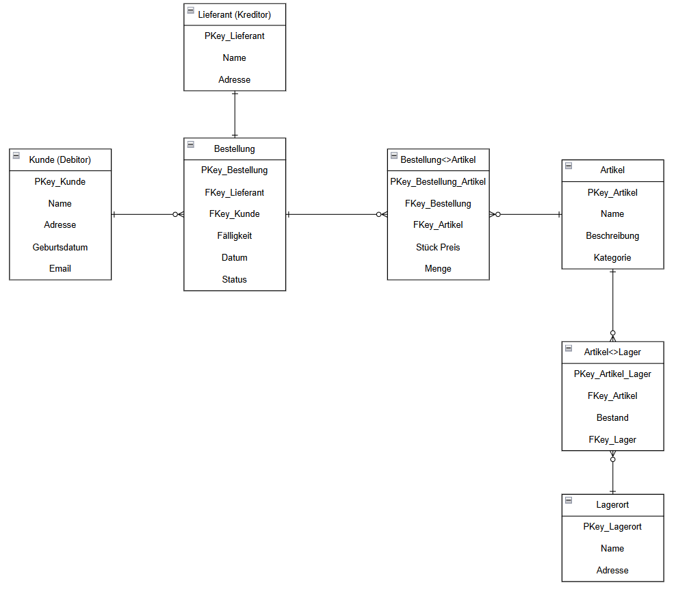

# ERP

## Situationsanalyse

Viele KMU benötigen ERP-Funktionen, können jedoch teure Systeme wie SAP oder Oracle nicht finanzieren.

In dieser Arbeit geht es darum ein ERPForAll zu erstellen.
Dies sollte diese Lücke mit einem Freemium-Modell schliessen:

- Gratis: Finanzmodul als Einstieg
- Kostenpflichtig: Lager- und Einkaufsmodul, später erweiterbar

Die Module sollten folgende Eigenschaften beinhalten:

| Modul             | Erforderliche Eigenschaften                                                              | Optionale Eigenschaften                     |
| ----------------- | ---------------------------------------------------------------------------------------- | ------------------------------------------- |
| **Finanzmodul**   | - Kreditoren verwalten - Debitoren verwalten - Umsatz pro Artikel erstellen können | - Mahnliste für säumige Debitoren           |
| **Lagermodul**    | - Lagerorte definieren - Lagermengen pro Artikel verwalten                            | - ABC-Liste für gelagerte Artikel erstellen |
| **Einkaufsmodul** | - Lieferanten (=Kreditoren) verwalten - Bestellungen von Artikeln verwalten           | - ABC-Liste der Lieferanten                 |

Ziel ist es, ein allgemeingültiges ERM zu entwerfen, dieses im SQL-Server umzusetzen und die resultierende Applikation anhand definierter Testszenarien zu prüfen.

## Planung

Zu Beginn unseres Projektes haben wir alle Tätigkeiten aufgelistet und die dafür benötigte Zeit geschätzt.
In der nachfolgenden Tabelle sind alle geschätzten und effektiv geleisteten Stunden ersichtlich:

Wir haben auch folgende Hauptziele für unser Projekt definiert.

Muss-Ziele:

- UI: Es ist eine grafische Oberfläche vorhanden, welche der Benutzer verwenden kann um Kreditoren, Debitoren etc. zu erfassen.
- DB-Zugriff: Das Tool greift auf eine SQL Datenbank zu und kann Daten persistieren.
- Module: Alle drei Module sind vorhanden und können aufgerufen werden.

Kann-Ziele:

- User-Verwaltung: Es ist eine Userverwaltung vorhanden in welcher die Benutzer verwaltet werden können.
- Unit-Tests: Alle definierten Tests sind als Unit-Tests vorhanden

## Anforderungsanalyse

Die Anforderungen und Risiken für unser Projekt haben wir wie folgt aufgelistet:

Das grösste Risiko für unser Projekt wäre, wenn Daten nicht gespeichert würden oder diese falsch abgelegt würden. Dies wäre kritisch, da somit Daten verloren gehen würden.

## Kontextdiagramme

Nach Analyse haben wir zuerst ein Kontextdiagramm mit allen Modulen erstellt:

Da dieses Kontextdiagramm sehr grob ist, haben wir für alle Module auch noch ein eigenes Kontextdiagramm erstellt.

### Kontextdiagramm Finanzmodul

### Kontextdiagramm Einkaufsmodul

### Kontextdiagramm Lagermodul

## Prozesse

Durch die Kontextdiagramme fiel uns uns leichter ein BPMN Diagramm abzuleiten:

Wir haben uns auch noch zwei Prozesse genauer angeschaut um die Szenarien und Module besser zu verstehen.

Prozess "Bestellt Artikel":

Prozess "Erstellt Rechnung":

## Korrelationsmatrix

Vor derm ERM wurde eine Korrelationsmatrix erstellt:

## ERM/ERD

Da wir dann ein gutes Verständnis hätten der Entitäten für unsere Appliktion konnten wir ein ERD für unsere Datenbank erstellen:

Anschliessend auch das ERM:

## Testfälle

Folgende Testfälle wurden definiert und abgearbeitet:

## Realisation

In unserer Applikation haben wir zuerst das UI mit Windows Forms erstellt:

Dabei haben wir uns für drei Tabs entschieden:

- Finanzmodul
- Lagermodul
- Einkaufsmodul

Um die Bedienung zu vereinfachen, sind bei den meisten Dropdown-Elementen Events hinterlegt, die beim Klicken automatisch die verfügbaren Daten laden und anzeigen.

### Finanzmodul

Im Finanzmodul lassen sich Kreditoren und Debitoren anlegen sowie abfragen.
Zusätzlich können Umsätze und eine Mahnliste angezeigt werden.
Die Mahnliste basiert auf dem jeweils gesetzten Rechnungsstatus, der hier direkt pro Rechnung angepasst werden kann.
Darüber hinaus bietet das Modul Funktionen zum Anlegen von Artikeln und Verkäufen.

### Lagermodul

Hier können neue Lagerorte erfasst, Lagermengen aktualisiert und die Artikel pro Lagerort übersichtlich dargestellt werden.

### Einkaufsmodul

Im Einkaufsmodul lassen sich Verkäufe pro Kreditor sowie Einkäufe pro Debitor anzeigen.

### Datenbank

Die Datenbank wurde über SQL Server Management Studio von Hand erstellt:

Sämtliche DB Skripts sind [hier](/src/DB_Scripts/) zu finden und wurden nach der Entwicklung aus dem Studio exportiert.

Nach dem Aufbau der Datenbank begann die Programmierung der Applikation.
Zunächst stellten wir die Verbindung zum SQL Server her, um Lese- und Schreiboperationen zu ermöglichen.

### Code-Struktur

Anfangs befand sich der gesamte Code in einer einzigen Datei, was rasch unübersichtlich wurde.
Wir entschieden uns deshalb für eine klare Aufteilung in Schichten und Ordner:

- Models: Enthält die Datenklassen für Entitäten wie Artikel, Kunde oder Rechnung.
- Data: Beinhaltet sämtliche SQL-Queries sowie Hilfsfunktionen für den Datenbankzugriff.

### Weitere Überlegungen

Ein User-Management haben wir nicht implementiert.
Die Idee ist, dass abhängig von der Lizenzierung, die einzelnen Module (Tabs) freigeschaltet werden können.
Nicht freigegebene Module erscheinen dann ausgegraut und sind nicht nutzbar.

## Durchführung Tests

Alle Tests wurden erfolgreich durchgeführt:

Somit können wir sicher sein, dass unsere Applikation so läuft, wie sie sollte.

## Fazit

Das Projekt zur Entwicklung eines ERPs war insgesamt erfolgreich und sehr lehrreich.
Die Anwendung der im Unterricht behandelten Konzepte, darunter die Erstellung von Diagrammen wie ERM, ERD und Korrelationsmatrix konnten anhand eines praktischen Beispiels angewandt werden.
Dies war sehr nützlich zur Festigung des gelernten Schulinhaltes.

Während der Entwicklung hatten wir zuerst einige Probleme mit dem Schreiben in die Datenbank. Als diese Probleme dann aber gelöst waren, konnten wir sehr schnell Fortschritte mit der Programmierung machen.
Dies verdeutlicht die Herausforderungen in der Softwareentwicklung, insbesondere in der Fehleranalyse und Behebung.
Alle wesentlichen Funktionen konnten trotzdem erfolgreich umgesetzt werden.

Wir haben auch bemerkt, dass das gemeinsame Arbeiten an einem Projekt zum Teil schwierig war, damit nicht die Änderung des Kollegen überschrieben werden.
Dies forderte eine gute Kommunikation im Team und ständiges absprechen.

Insgesamt war das Projekt eine gute Erfahrung, die Spass gemacht hat und einen praktischen Bezug zur Theorie herstellte.
