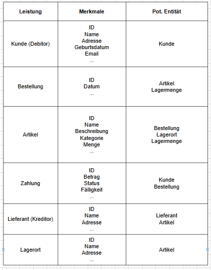

# ERP

## Situationsanalyse

Viele KMU benötigen ERP-Funktionen, können jedoch teure Systeme wie SAP oder Oracle nicht finanzieren.

In dieser Arbeit geht es darum ein ERPForAll zu erstellen.
Dies sollte diese Lücke mit einem Freemium-Modell schliessen:

- Gratis: Finanzmodul als Einstieg
- Kostenpflichtig: Lager- und Einkaufsmodul, später erweiterbar

## Planung

Zu Beginn unseres Projektes haben wir alle Tätigkeiten aufgelistet und die dafür benötigte Zeit geschätzt.
In der nachfolgenden Tabelle sind alle geschätzten und effektiv geleisteten Stunden ersichtlich:

## Kontextdiagramme

Nach Analyse der Situation und Ausgangslage haben wir zuerst ein Kontextdiagramm mit allen Modulen erstellt:

Da dieses Kontextdiagramm sehr grob ist, haben wir für alle Module auch noch ein eigenes Kontextdiagramm erstellt.

### Kontextdiagramm Finanzmodul

### Kontextdiagramm Einkaufsmodul

### Kontextdiagramm Lagermodul

## Prozesse

Wir haben uns auch noch zwei Prozesse genauer angeschaut um die Szenarien und Module besser zu verstehen.

Prozess "Bestellt Artikel":

Prozess "Bestellt Artikel":

## Anforderungsanalyse

Auch die Anfoderungen wurden aufgelistet:

## ERM/ERD

Da wir dann ein gutes Verständniss hätten der jeweiligen Module konnten wir ein ERD für unsere Datenbank erstellen:

Anschlissend auch das ERM:

## Korrelationsmatrix

Durch das ERM konnte auch eine Korrelationsmatrix erstellt werden:

## Klassendiagramm

Auch eine Klassendiagramm haben wir noch erstellt:

## Testfälle

Folgende Testfälle wurden definiert und abgearbeitet:

## Realisation

In unserer Applikation haben wir zuerst das UI mit Windows Forms erstellt:

Dabei haben wir uns für drei Tabs entschieden:

- Finanzmodul
- Lagermodul
- Einkaufsmodul

In unserer Applikation wird je nach Lizenz, welcher der Benutzer hat, die ensprechenden Tabs aufgeschaltet. Die restlichen Tabs werden ausgegraut. Deshalb wurd keine Userverwaltung erstellt.

Die Datenbank wurde über SQL Server Management Studio von Hand erstellt:

Sämtliche DB Skripts sind [hier](/src/DB_Scripts/) zu finden. Diese wurden nachfolgend automatisch via Studio erstellt und abgelegt.

Nach der Erstellung der Datenbank haben wir mit der Programmierung begonnen. Dabei mussten wir zuerst die Verbindung zur Datenbank herstellen, damit wir in diese schreiben können.

Zu Beginn der Programmierung hatten wir den gesamten Code in einer Daten. Da dies schnell unübersichtlich wurde, mussten wir den Code aufteilen:

Die einzelnen Klassen haben wir im Models Ordner abgelegt. Die SQL Queries im Data Ordner, auch andere Helper, wie ein Helper um in die Datenbank zu schreiben, wurde in diesem Ordner abgelegt.

Dies hat uns geholfen, den Code strukturierter zu halten und es konnte einfacher parallel am Code gearbeitet werden.

## Durchführung Tests

Alle Tests wurden erfolgreich durchgeführt:

Somit können wir sicher sein, dass unsere Applikation so läuft, wie sie sollte.

## Fazit

Das Projekt zur Entwicklung eines ERPs war insgesamt erfolgreich und sehr lehrreich.
Die Anwendung der im Unterricht behandelten Konzepte, darunter die Erstellung von Diagrammen wie ERM, ERD und Kollerationsmatrix konnten anhand eines praktischen Beispiels angewandt werden.
Dies war sehr nützlich zur Festigung des gelernten Schulinhaltes.

Während der Entwicklung hatten wir zuerst einige Probleme mit dem Schreiben in die Datenbank. Als diese Probleme dann aber gelöst waren, konnten wir sehr schnell Fortschritte mit der Programmierung machen.
Dies verdeutlicht die Herausforderungen in der Softwareentwicklung, insbesondere in der Fehleranalyse und Behebung.
Alle wesentlichen Funktionen erfolgreich umgesetzt werden.

Wir haben auch bemerkt, dass das gemeinsame Arbeiten an einem Projekt zum Teil schwierig war, damit nicht die Änderung des Kollegen überschrieben werden.
Dies forderte eine gute kommunikation im Team und ständiges aktualisieren.

Insgesamt war das Projekt eine gute Erfahrung, die Spass gemacht hat und einen praktischen Bezug zur Theorie herstellte.
